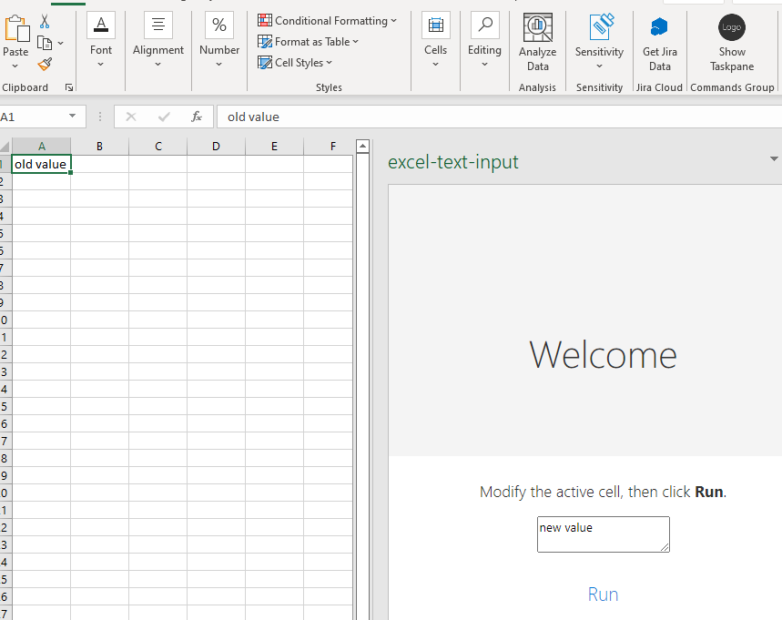

## Task overview

Create an Excel add-in which allows the user to open a task pane. The task pane 
should have a text box/ input area, where the user can edit the content of the currently selected cell. 
Once the user selects a different cell, the text in the text box should disappear.

## Dependencies setup
Please make sure you have the Excel desktop version installed Before proceeding further!

Install dependencies by running `npm i` .

## Running locally
Start dev server by running `npm run dev-server`.

Running locally with `npm start`.

Please click on the `Show Taskpane` button in order to open the Excel add in.
Entering text in the Taskpane text box will automatically update the active cell. 

## Further notes

The skeleton of this project was generated by the [Yeoman generator for Office Add-ins](https://github.com/OfficeDev/generator-office). 
The custom build Excel task pane add-in code is in `src/taskpane`.